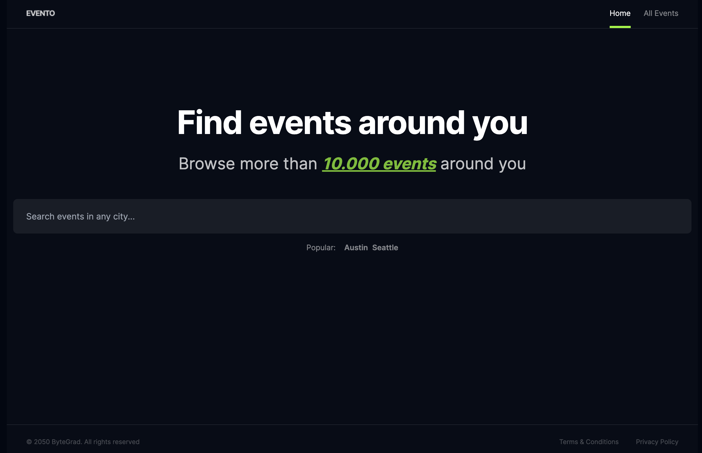

# Next.js Evento

Next.js Evento created with HtML, CSS, TypeScript and Next.js.

Created during React Tutorial
https://bytegrad.com/app/professional-react-and-nextjs/



## Learnings

- Routing strategy (layout and pages files; dynamic routes e.g. with [slug]; Link component in Next.js)
- Import logo with Next.js image component
- Use accent color in Tailwind (config)
- Set metadata + favicon for the project
- Determine active path in url: usePathname()
- Server vs Client components
- use clsx()
- use Framer Motion with layoutid (layoutid is used to identify a motion element -> different divs with the same layoutid become the same div for Framer Motion and the difference will be animated)
- Handle form submit event
- Navigate to a route using useRouter() with .push('route-path')
- Create events page with styling
- Add reusable h1 component
- Add scrollbar styling
- Get params in page component
- Fetch events in a server component without useEffect
- Type Evento event in a lib/types.ts file

## Install clsx()

```bash
npm install clsx
```

## Install FramerMotion

```bash
npm install framer-motion@10.16.4
```

## Other Learnings

- Use types instead of interfaces -> describe primitive values (string, number, boolean) -> describe union types -> utility-types -> describe tupels -> extract type from something else
- cn() utility function for TailwindCSS
- use Tailwind Merge packge for TailwindCSS
- use one object and function to update multiple states:

```JS
const [form, setForm] = useState({
	firstName: "",
	lastName: "",
	email: "",
	password: "",
	address: "",
	zipCode: ""
});

const handleChange = (e) => {
	setForm({
		...form,
		[e.target.name]: e.target.value
	});
};
```

- Derive information from state
- Components rerender when the state changes!
- Primitives vs. Non-primitives (objects / arrays)
- Use custom hooks
- Client vs server components
- Avoid using fetch API in useEffect
